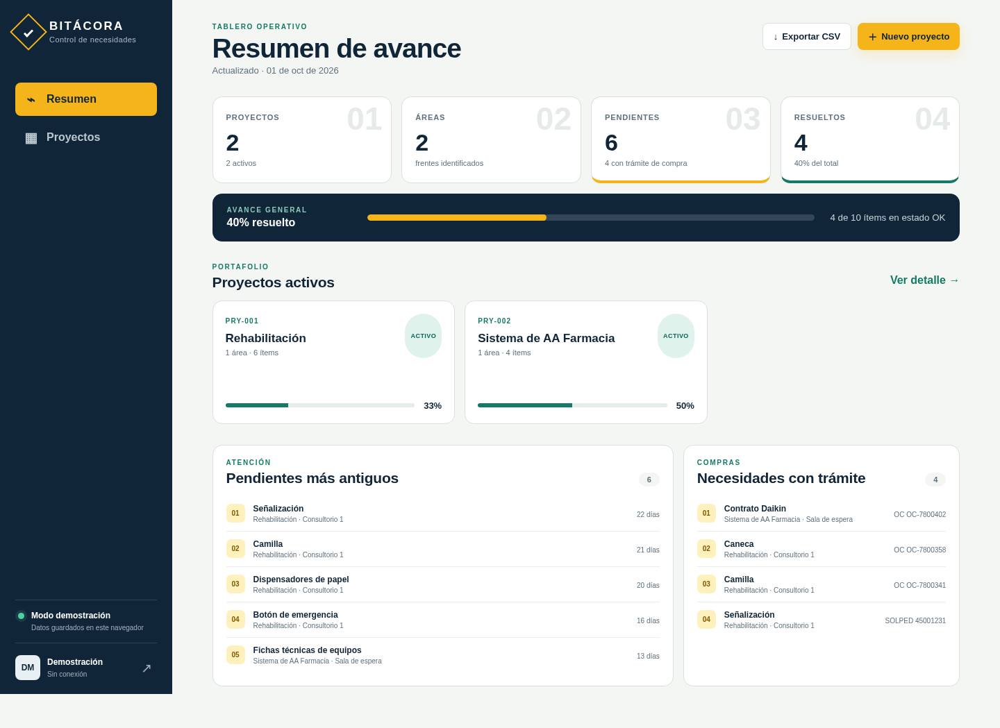

# Bitácora de proyectos

Aplicación web para registrar y dar seguimiento a necesidades y actividades con la estructura **Proyecto → Área → ítems del checklist**. Su propósito es responder con rapidez: **qué se necesita, cuándo se identificó y si ya está resuelto**. SOLPED y OC son referencias opcionales; la aplicación no pretende ser un sistema de costos.



> También se incluyen capturas de la vista de proyectos, la versión móvil y la autenticación en `docs/screenshots/`.

## Funcionalidades

- Creación, consulta, edición y eliminación de proyectos, áreas e ítems.
- Estado de cada ítem: **Pendiente** u **OK**, con cambio rápido desde la tabla.
- Fecha de identificación, descripción, observaciones, SOLPED y orden de compra (OC).
- Resumen de avance general y por proyecto.
- Listas de pendientes más antiguos y necesidades con trámite de compra.
- Búsqueda global y filtros por proyecto, estado y presencia de SOLPED/OC.
- Exportación a CSV compatible con Excel en configuración regional en español.
- Diseño adaptable para escritorio, tableta y móvil.
- Autenticación por correo/contraseña con Supabase Auth.
- Persistencia en PostgreSQL/Supabase y políticas RLS por usuario.
- Modo demostración completamente funcional con datos locales y ejemplos de Rehabilitación y Sistema de AA Farmacia.
- Despliegue preparado para Netlify y GitHub Pages.

## Inicio inmediato: modo demostración

No requiere instalación ni conexión:

1. Descomprima el proyecto.
2. Abra `index.html` en un navegador moderno.
3. La app iniciará con datos de muestra y guardará los cambios en `localStorage`.
4. El botón de salida de la barra lateral reinicia la demostración.

También puede servir la carpeta por HTTP:

```bash
python3 -m http.server 8080
# Abra http://localhost:8080
```

> El modo demostración es local a cada navegador. No sincroniza datos ni autentica usuarios.

## Arquitectura

La aplicación usa HTML, CSS y JavaScript estándar, sin frameworks ni dependencias de frontend. Se comunica con Supabase mediante sus APIs REST de Auth y PostgREST. Esto reduce la superficie de dependencias y permite abrir la demo directamente desde disco.

```text
bitacora-proyectos/
├── index.html                     # Interfaz y diálogos
├── styles.css                     # Identidad visual y diseño adaptable
├── app.js                         # Estado, UI, CRUD, filtros, CSV y acceso REST
├── config.js                      # Configuración local (demo activa)
├── config.example.js              # Ejemplo para Supabase
├── .env.example                   # Variables de compilación
├── netlify.toml                   # Build, publicación, headers y SPA fallback
├── package.json                   # Comandos de verificación y build
├── scripts/
│   ├── build.mjs                  # Genera dist/ e inyecta la configuración
│   └── check.mjs                  # Verifica archivos y referencias
├── supabase/migrations/
│   └── 202610010001_initial.sql   # Esquema, índices, triggers y RLS
└── .github/workflows/pages.yml    # Build y despliegue a GitHub Pages
```

## Modelo de datos

### `projects`

| Campo | Tipo | Uso |
|---|---|---|
| `id` | UUID | Identificador |
| `user_id` | UUID | Propietario autenticado |
| `name` | text | Nombre del proyecto |
| `code` | text | Código opcional |
| `description` | text | Alcance opcional |
| `status` | enum | `active` o `closed` |

### `areas`

Pertenece a un proyecto. Incluye nombre, descripción y `sort_order`.

### `checklist_items`

Pertenece a un área y un proyecto. Incluye `identified_on`, descripción, estado `pending`/`ok`, observaciones, `solped` y `purchase_order`.

Las relaciones tienen eliminación en cascada: eliminar un proyecto elimina sus áreas e ítems; eliminar un área elimina sus ítems. La interfaz muestra una confirmación explícita antes de estas acciones.

## Configuración de Supabase

### 1. Crear el proyecto

1. Cree un proyecto en [Supabase](https://supabase.com/).
2. En **Authentication → Providers**, mantenga habilitado Email.
3. Defina si exigirá confirmación de correo. Para una prueba interna rápida puede deshabilitarla temporalmente.

### 2. Crear la base de datos

Abra **SQL Editor**, copie todo el contenido de:

```text
supabase/migrations/202610010001_initial.sql
```

y ejecútelo. La migración crea tablas, enumeraciones, índices, triggers de actualización, validación de jerarquía y políticas RLS.

Si usa Supabase CLI:

```bash
supabase link --project-ref SU_REFERENCIA
supabase db push
```

### 3. Obtener credenciales públicas

En **Project Settings → API** copie:

- Project URL → `SUPABASE_URL`
- Clave `anon`/publishable → `SUPABASE_ANON_KEY`

**Nunca utilice la clave `service_role` en esta aplicación.** La clave anon es pública por diseño; la seguridad real la aplican la autenticación y las políticas RLS.

### 4. Desarrollo local conectado

Copie `config.example.js` sobre `config.js` y complete los valores:

```js
window.APP_CONFIG = {
  SUPABASE_URL: 'https://xxxx.supabase.co',
  SUPABASE_ANON_KEY: 'clave-anon-publica',
  DEMO_MODE: false
};
```

Sirva la carpeta por HTTP. Supabase Auth no debe probarse abriendo el archivo mediante `file://`.

## Políticas RLS incluidas

RLS está activado para las tres tablas. Las políticas exigen que:

- `user_id = auth.uid()` para leer, crear, editar o eliminar.
- Un área apunte a un proyecto del mismo usuario.
- Un ítem apunte a un área y proyecto coherentes y del mismo usuario.
- Un trigger de base de datos rechace una jerarquía de ítem inconsistente.

La configuración actual implementa espacios privados por usuario. Si varios miembros deben colaborar en un mismo proyecto, amplíe el modelo con una tabla `project_members` y reemplace las políticas de propietario por políticas de membresía.

## Desplegar en Netlify

### Desde GitHub

1. Cree un repositorio y suba el contenido de esta carpeta.
2. En Netlify, seleccione **Add new site → Import an existing project**.
3. Seleccione el repositorio. Netlify detectará `netlify.toml`:
   - Build command: `npm run build`
   - Publish directory: `dist`
4. En **Site configuration → Environment variables**, agregue:
   - `SUPABASE_URL`
   - `SUPABASE_ANON_KEY`
   - `DEMO_MODE=false`
5. Despliegue.
6. En Supabase, agregue la URL de Netlify en **Authentication → URL Configuration → Redirect URLs**.

Para publicar una demostración sin Supabase, omita las dos credenciales y use `DEMO_MODE=true`.

## Desplegar en GitHub Pages

El workflow `.github/workflows/pages.yml` ya está incluido.

1. Suba el proyecto a un repositorio con rama `main`.
2. En **Settings → Pages → Build and deployment**, seleccione **GitHub Actions**.
3. Para Supabase, cree los secretos del repositorio `SUPABASE_URL` y `SUPABASE_ANON_KEY`.
4. Cree la variable del repositorio `DEMO_MODE` con `false`. Si no la define, el workflow publica la demo.
5. Haga push a `main` o ejecute el workflow manualmente.
6. Agregue la URL final de GitHub Pages a las Redirect URLs de Supabase.

## Build y verificación

Requiere Node.js 18 o superior y no instala dependencias:

```bash
npm run check
npm run build
```

El build genera `dist/` con solo los cuatro archivos públicos. Las variables de entorno se inyectan en `dist/config.js`.

Ejemplo local conectado:

```bash
SUPABASE_URL='https://xxxx.supabase.co' \
SUPABASE_ANON_KEY='clave-anon-publica' \
DEMO_MODE=false npm run build
npx serve dist
```

## Flujo recomendado de uso

1. Cree el proyecto y opcionalmente asigne código y descripción.
2. Cree una o más áreas/subtareas.
3. Registre cada necesidad con su fecha de identificación.
4. Use observaciones para contexto, bloqueo, responsable o siguiente paso.
5. Complete SOLPED u OC solo cuando aplique.
6. Cambie el estado a OK al resolver la necesidad.
7. Revise el resumen y filtre pendientes o trámites de compra.
8. Exporte CSV para cortes, comités o respaldo operativo.

## Seguridad y operación

- No almacene secretos privados en `config.js`, variables de frontend ni secretos de GitHub usados en el build. Solo la URL y clave anon/publishable.
- Mantenga RLS habilitado. No cree políticas públicas amplias para “resolver” errores de acceso.
- Para producción, habilite reglas de contraseña, confirmación de correo y MFA según las políticas de su organización.
- El CSV se genera localmente y no envía información a terceros.
- Defina una estrategia de respaldo desde Supabase para información crítica.

## Solución de problemas

- **La pantalla de autenticación no aparece:** confirme `DEMO_MODE: false` y que URL/clave no estén vacías.
- **`Invalid login credentials`:** verifique cuenta, contraseña y confirmación de correo.
- **No aparecen registros:** confirme que la migración se ejecutó y que el usuario actual es propietario de los datos.
- **Error RLS al guardar:** no deshabilite RLS; revise que la sesión siga activa y que proyecto/área pertenezcan al mismo usuario.
- **Netlify muestra demo:** revise las variables del sitio y lance un nuevo deploy sin caché.
- **GitHub Pages muestra demo:** defina `DEMO_MODE=false` como variable del repositorio y agregue los dos secretos.

## Licencia

MIT. Consulte `LICENSE`.
